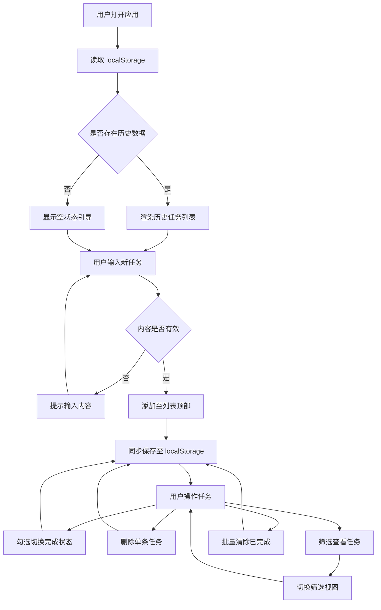

# 待办事项应用（TodoList）产品需求文档

## 1. 产品概述
一款基于 React + Vite 构建的轻量级待办事项管理应用，帮助用户高效记录、组织和追踪日常任务。
- **核心目的**：解决个人任务管理痛点，提供简洁直观的待办事项记录与追踪体验
- **目标用户**：需要轻量级任务管理工具的个人用户、学生及职场人士
- **产品价值**：零依赖本地存储、即开即用、数据持久化、跨设备响应式适配

## 2. 核心功能

### 2.2 功能模块
1. **主页面**：任务输入区、任务列表区、统计筛选区、空状态引导

### 2.3 页面详情
| 页面名称 | 模块名称 | 功能描述 |
|-----------|-------------|---------------------|
| 主页面 | 任务输入区 | 输入框支持回车快速添加任务，输入校验与占位提示 |
| 主页面 | 任务列表区 | 单条任务展示，支持勾选完成、删除、文本展示与状态切换 |
| 主页面 | 统计筛选区 | 显示任务总数、已完成数、未完成数；支持全部/进行中/已完成筛选 |
| 主页面 | 批量操作区 | 一键清除已完成任务、切换全部任务状态 |
| 主页面 | 空状态引导 | 无任务时的友好引导文案与图标提示 |
| 主页面 | 本地存储 | 自动持久化到 localStorage，刷新后数据不丢失 |

## 3. 核心流程
用户打开应用 → 读取本地存储恢复历史任务 → 在输入框输入任务内容 → 回车或点击添加按钮 → 任务进入列表 → 勾选/取消勾选切换完成状态 → 筛选查看不同状态任务 → 删除或清除已完成任务 → 所有变更实时同步至 localStorage

## 4. 用户界面设计

### 4.1 设计风格
- **美学方向**：「暖意编辑式生产力」(Warm Editorial Productivity)，融合杂志编辑感与温润手作质感，区别于常见冷蓝色 Todo 应用
- **主色调**：温润米白底 (#FAF6F0) + 深墨炭黑文字 (#1A1A1A) + 暖陶土橙强调色 (#E07856)
- **辅助色**：鼠尾草绿 (#7A9E7E) 表示已完成态、柔灰 (#D9D2C9) 表示边框分隔
- **按钮风格**：圆角矩形 (8-12px)，主按钮为陶土橙实心，次按钮为描边样式
- **字体方案**：标题使用 Fraunces 衬线体（带性格的编辑感），正文使用 DM Sans 现代无衬线体
- **布局风格**：单列居中卡片式布局，最大宽度 640px，留白克制而有节奏
- **图标风格**：线性手绘风 SVG 图标，圆角端点，与整体温润气质呼应
- **氛围细节**：背景叠加极细颗粒噪点纹理，卡片带柔和投影制造层次

### 4.2 页面设计概览
| 页面名称 | 模块名称 | UI 元素 |
|-----------|-------------|-------------|
| 主页面 | 顶部标题区 | 大号衬线标题 + 当前日期副标题，左对齐编辑感 |
| 主页面 | 任务输入区 | 圆角输入框 + 陶土橙添加按钮，焦点态有暖色边框 |
| 主页面 | 任务列表区 | 卡片列表，每项含勾选圆圈、任务文本、删除图标；已完成项文字删除线 + 降透明度 |
| 主页面 | 统计筛选区 | 数字统计 + 三个筛选标签（全部/进行中/已完成），激活态有下划线 |
| 主页面 | 批量操作区 | 底部清除已完成按钮，淡灰描边样式 |
| 主页面 | 空状态 | 居中插画图标 + 引导文案 + 添加提示 |

### 4.3 响应式设计
- **桌面优先**：最大宽度 640px 居中，留白充足，hover 态丰富
- **平板适配**：宽度自适应，触摸目标增大至 44px+
- **移动适配**：全宽布局，字号略减，输入框固定底部吸顶便于单手操作
- **触摸优化**：删除与勾选区域扩大点击热区，避免误触

### 4.4 微交互设计
- 任务添加：从顶部淡入下滑入场动画
- 任务完成：勾选圈填充动画 + 文字删除线过渡 + 颜色渐变
- 任务删除：向右滑出消失动画
- 筛选切换：列表淡入重排过渡
- 页面加载：标题与输入区错峰入场
