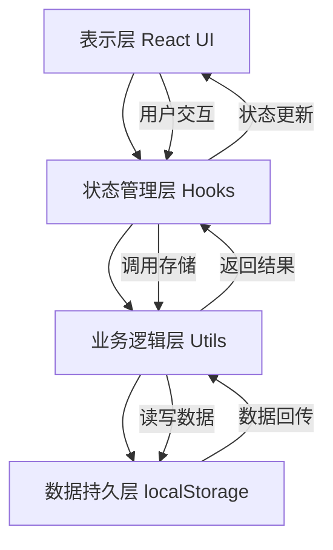
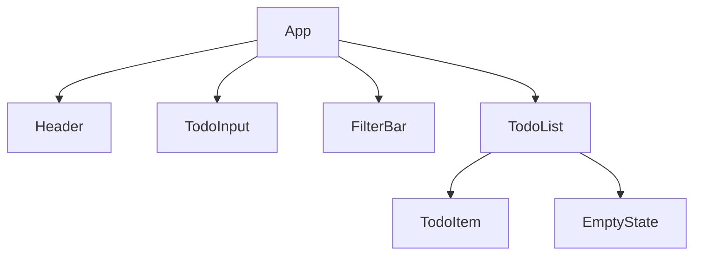
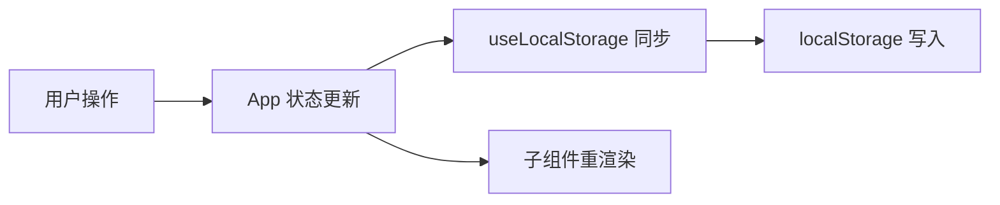

# 待办事项应用（TodoList）技术架构文档

## 1. 架构设计
纯前端单页应用，无后端服务，数据持久化依赖浏览器 localStorage。



## 2. 技术说明
- **前端框架**：React@18 + Vite@5
- **初始化工具**：vite-init（npm create vite@latest）
- **样式方案**：Tailwind CSS@3 + 自定义 CSS 变量
- **图标方案**：内联 SVG 组件（避免外部依赖）
- **字体方案**：Google Fonts（Fraunces + DM Sans）
- **状态管理**：React Hooks（useState、useEffect、useMemo）
- **存储方案**：localStorage API 封装为自定义 Hook
- **后端**：无
- **数据库**：无（localStorage 即数据源）

## 3. 路由定义
| 路由 | 用途 |
|-------|---------|
| / | 主页面，包含任务输入、列表、筛选与统计全部功能 |

单页应用无需路由库，单一视图承载所有功能。

## 4. 目录结构
```
demo/
├── index.html              # 入口 HTML，加载字体与根节点
├── package.json            # 依赖与脚本
├── vite.config.js          # Vite 配置
├── tailwind.config.js      # Tailwind 配置
├── postcss.config.js       # PostCSS 配置
└── src/
    ├── main.jsx            # 应用入口
    ├── App.jsx             # 根组件，组合各功能模块
    ├── App.css             # 全局样式与设计令牌
    ├── index.css          # Tailwind 指令
    ├── components/         # 展示组件
    │   ├── Header.jsx     # 顶部标题区
    │   ├── Header.css
    │   ├── TodoInput.jsx   # 任务输入区
    │   ├── TodoInput.css
    │   ├── TodoItem.jsx    # 单条任务项
    │   ├── TodoItem.css
    │   ├── TodoList.jsx    # 任务列表容器
    │   ├── TodoList.css
    │   ├── FilterBar.jsx   # 统计筛选区
    │   ├── FilterBar.css
    │   └── EmptyState.jsx  # 空状态引导
    │       EmptyState.css
    ├── hooks/              # 自定义 Hook
    │   └── useLocalStorage.js  # localStorage 封装
    └── utils/              # 工具函数
        └── todoUtils.js    # 任务相关纯函数
```

## 5. 组件设计

### 5.1 组件层级


### 5.2 组件职责
| 组件 | 职责 | 输入 | 输出/事件 |
|------|------|------|-----------|
| App | 应用根容器，管理全局状态与数据流 | 无 | 派发状态至子组件 |
| Header | 渲染标题与当前日期 | 无 | 无 |
| TodoInput | 接收用户输入并提交新任务 | onAdd 回调 | 触发添加任务 |
| TodoItem | 展示单条任务，处理勾选与删除 | todo 数据、onToggle、onDelete | 触发状态切换与删除 |
| TodoList | 渲染任务列表，处理空状态 | todos、筛选条件、回调函数 | 渲染 TodoItem 或 EmptyState |
| FilterBar | 统计展示与筛选切换 | 统计数据、当前筛选、onChange | 切换筛选、批量清除 |
| EmptyState | 空列表引导 | 无 | 无 |

## 6. 数据模型

### 6.1 数据结构定义
单个任务项数据结构：
```typescript
interface Todo {
  id: string          // 唯一标识，使用 crypto.randomUUID()
  text: string        // 任务内容
  completed: boolean  // 完成状态
  createdAt: number   // 创建时间戳
}
```

localStorage 存储结构：
```typescript
// key: 'todolist:todos'
// value: JSON 序列化的 Todo[]
type StoredTodos = Todo[]
```

### 6.2 数据流设计


### 6.3 自定义 Hook 设计
```javascript
// useLocalStorage.js
// 封装 localStorage 读写，提供与 useState 一致的 API
// 自动处理 JSON 序列化/反序列化
// 提供 key 命名空间隔离
const [todos, setTodos] = useLocalStorage('todolist:todos', [])
```

## 7. 关键实现说明

### 7.1 状态管理策略
- App 组件持有 todos（任务数组）与 filter（当前筛选）两个核心状态
- 通过 props 向下传递数据与回调
- 使用 useMemo 优化筛选后的列表渲染性能

### 7.2 持久化策略
- 每次 todos 变更自动同步至 localStorage
- 应用初始化时从 localStorage 读取，无数据时返回空数组
- 使用 try-catch 包裹 localStorage 操作，防止 quota 超限或禁用场景

### 7.3 响应式实现
- 使用 Tailwind 响应式断点（sm/md/lg）
- 桌面端固定最大宽度居中，移动端全宽
- 字号与间距使用 Tailwind 响应式工具类

### 7.4 设计令牌（CSS 变量）
```css
:root {
  --color-bg: #FAF6F0;
  --color-surface: #FFFFFF;
  --color-text: #1A1A1A;
  --color-text-muted: #6B6B6B;
  --color-accent: #E07856;
  --color-accent-soft: #F4D4C8;
  --color-success: #7A9E7E;
  --color-border: #E8E2D8;
  --shadow-card: 0 2px 12px rgba(26, 26, 26, 0.06);
  --radius-sm: 8px;
  --radius-md: 12px;
}
```
